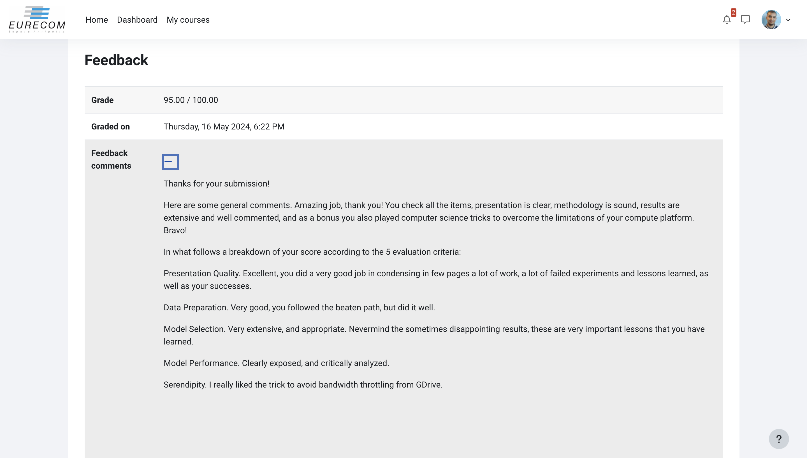

# Summary of the Challenge

#### Overview
The challenge aims to quantify the impact of human activities on protected natural areas by recognizing vegetation in these regions. Specifically, participants are tasked with creating an algorithm to identify a type of cactus, **Neobuxbaumia tetetzo**, in aerial imagery as part of the VIGIA project in Mexico. This competition is inspired by a similar competition on Kaggle.

#### Dataset Description
The dataset includes:
- **32 x 32 thumbnail images** of aerial photos featuring the columnar cactus.
- **Training images** are provided with labels indicating the presence of the cactus.
- **Test images** for which predictions must be made (labels not provided).

Participants need to create a classifier that predicts whether an image contains a cactus. The dataset can be downloaded from Kaggle or Moodle.

#### Files
- **train/**: Directory containing training images.
- **test/**: Directory containing test images.
- **train.csv**: File containing labels for the training set (has_cactus = 1).
- **sample_submission.csv**: A sample submission file format used for automated evaluation.

#### Challenge Tasks
1. **Characterize the Data**: Analyze the dataset to understand its characteristics and balance.
2. **Define a Metric**: Choose a suitable performance metric for the binary classification task.
3. **Model Development**: Create a model to predict the presence of the cactus in images.
4. **Validation**: Split the training set to create validation and test data for model performance evaluation.

#### Important Notes
- **Unlabeled Test Set**: The test set does not include labels, simulating a real-world scenario where predictions are made on unseen data.
- **Submission**: Predictions should be submitted in the format (ID, predicted labels) for comparison with the secret ground truth.

Participants are encouraged to experiment with original approaches, including using advanced techniques like "Visual Question Answering" models to synthetically label data.

<!-- # Professor  [P.MICHIARDI's](https://www.eurecom.fr/en/people/michiardi-pietro)  Feedback on our report:

 -->
