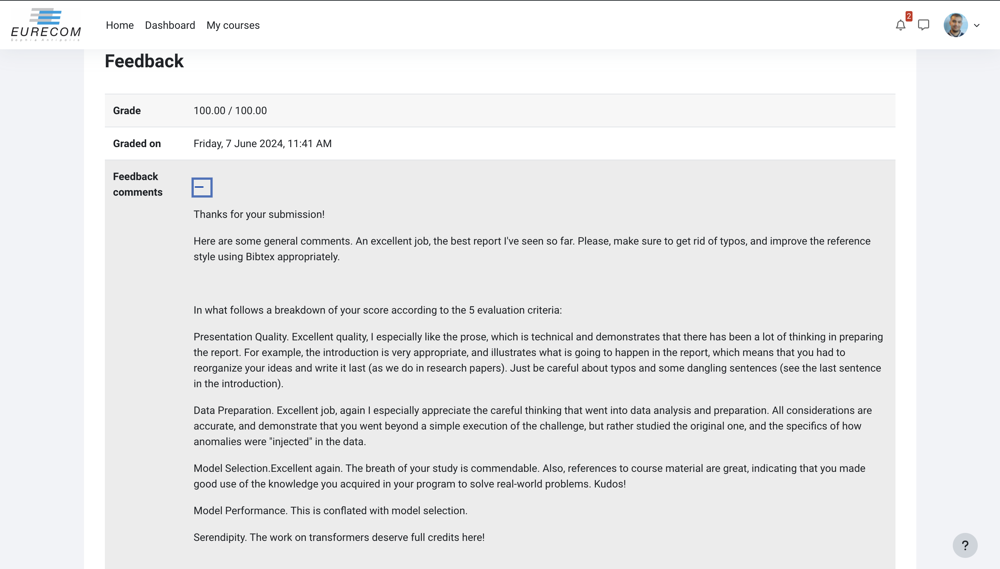

# Overview

We replicate the DCASE challenge, focused on "Detection and Classification of Acoustic Scenes and Events." Specifically, this task involves detecting anomalous sounds from machines using only normal sound samples for training.

#### Objective
Develop a model to identify if an unknown sound from a given machine ID is normal or anomalous.

#### Dataset Description
- **Sources**: ToyADMOS and MIMII datasets.
- **Machines**: Six types (toy-car, toy-conveyor, valve, pump, fan, slide rail). We'll focus on slide rail.
- **Data**: 10-second, single-channel audio recordings with machine and environmental noise.

#### Recording Procedure
- **ToyADMOS**: Normal/anomalous sounds from toy machines, recorded with four microphones.
- **MIMII**: Normal/anomalous sounds from real machines, recorded with eight microphones.
- **Simplification**: Used only first channel recordings, downsampled to 16 kHz.

#### Datasets
- **Development**: 1,000 normal samples per Machine ID, 100-200 normal/anomalous samples for testing.
- **Evaluation**: 400 test samples per Machine ID (different from development IDs), no labels.
- **Additional Training**: 1,000 normal samples per Machine ID for evaluation dataset machines.

#### Task Requirements
1. **Model Training**: Use normal sound samples for training.
2. **Validation**: Split training set for validation.
3. **Metric**: Use Area Under Curve (AUC) for evaluation.
4. **No Labels for Test Set**: Predict labels for unseen data.

#### Data Access
- Available on Kaggle. Download to local machine or use Kaggle platform.

#### Important Note
Focus on methodology over performance. Invent original approaches, such as using pre-trained models for synthetic labeling.

### Grade: 100/100
<!-- # Professor  [P.MICHIARDI's](https://www.eurecom.fr/en/people/michiardi-pietro)  Feedback on our report:

 -->

