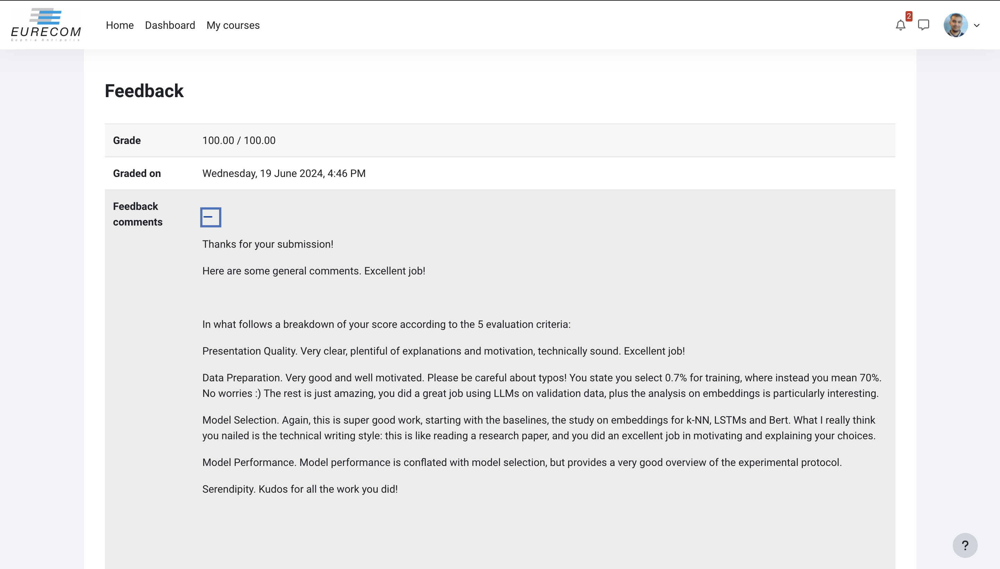

### Overview

Sentiment analysis involves extracting sentiment from large datasets. This challenge focuses on classifying tweets as positive, neutral, or negative.

#### Objective
Classify tweets into positive, neutral, or negative sentiment.

#### Dataset Description
- **Source**: Figure Eight's Data for Everyone platform.
- **Files**:
  - **train.csv**: Training set.
  - **test.csv**: Test set.
  - **sample_submission.csv**: Sample submission file (not used).

#### Task Requirements
1. **Model Training**: Use training set to build a classifier.
2. **Validation**: Split training set for validation.
3. **Metric**: Use Macro F1-Score for evaluation.
4. **Bonus Task**: Detect relevant words responsible for sentiment using the Jaccard coefficient.

#### Data Access
- Available on Kaggle. Download to local machine or use Kaggle platform.

#### Important Note
Focus on methodology over performance. The test set labels are not provided, simulating a real-world scenario. Split the training set for validation to check model performance.

### Grade: 100/100
<!-- # Professor  [P.MICHIARDI's](https://www.eurecom.fr/en/people/michiardi-pietro)  Feedback on our report:

 -->
